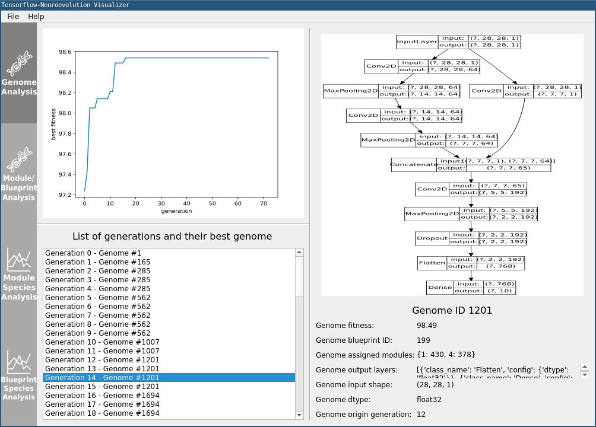

## The Tensorflow-Neuroevolution Framework ##

  

**Version 0.21.0**

[TFNE PROJECT DESCRIPTION HERE]

--------------------------------------------------------------------------------

### Installation ###

foobar

--------------------------------------------------------------------------------

### Usage ###

[list examples]

[list general usage of TFNE and its extendability]

[show TFNE Architecture illustration in the context of being relevant when talking about extending TFNE]

--------------------------------------------------------------------------------

### Visualizer ###

foobar

  

--------------------------------------------------------------------------------

### Documentation ###

foobar

--------------------------------------------------------------------------------

### About ###

Project developed by [Paul Pauls](https://github.com/PaulPauls) in collaboration with [Rezsa Farahani](https://www.linkedin.com/in/rezsa). \
We would like to thank the larger Google Tensorflow team for their support in this project!

<!---

Rework Notes:
> Don't list Encodings and algorithms in that checkable format, but only list
  in a regular list all implemented algorithms.
> Mention that algorithm, population and encoding are modularly seperated to
  increase reuse, maintainability, etc
> Mention only the most popular environments in README and list all environments
  in RTD

The **TensorFlow-NeuroEvolution [abbr. TFNE]** framework aims to provide a fast prototyping framework for neuroevolution algorithms realized with Tensorflow 2.x. While the framework is certainly optimized for high performance does the design focus on maintainability, modularity and extendability by allowing for a seamless interchange of the three main concerns of neuroevolution - the genome encoding, the neuroevolution algorithm and the evaluation environment. \
TFNE comes with a variety of pre-implemented neuroevolution algorithms, encodings and environments that are all highly optimized and extensively documented. The phenotypes (Neural Networks encoded through the genome) created through the pre-implemented genome encodings make heavy use of Tensorflow and its internal optimization. The Tensorflow models are exclusively created through the keras functional API and therefore allow for high-performance as well as full compatibility with the rest of the Tensorflow ecosystem. This eliminates a common dread in other evolutionary frameworks in which the evolved genome and its phenotype is not compatible with other machine learning frameworks. \
All neuroevolution algorithms are controlled through the central evolution engine, which initializes required libraries and initiates each step of the evolutionary process. The evolution engine allows for the usage of custom or prototyped algorithms, encodings or environments, given they adhere to the abstract interfaces supplied for each neuroevolution aspect.

---------------------------------------------------------

### Pre-Implemented Algorithms, Encodings and Environments ###

*Neuroevolution Algorithms:*
* [x] (see v0.1) Neuroevolution of Augmenting Topologies (NEAT) [[paper](http://nn.cs.utexas.edu/keyword?stanley:phd04) | doc | code]
* [ ] HyperNEAT [[paper](https://ieeexplore.ieee.org/document/6792316) | doc | code]
* [ ] ES-HyperNEAT [[paper](https://eplex.cs.ucf.edu/papers/risi_gecco10.pdf) | doc | code]
* [ ] DeepNEAT [[paper](https://arxiv.org/abs/1703.00548) | doc | code]
* [X] CoDeepNEAT [[paper](https://arxiv.org/abs/1703.00548) | doc | [code](./tfne/algorithms/codeepneat/)]

*Genome Encodings:*
* [X] (see v0.1) NEAT Encoding [doc | code]
* [X] CoDeepNEAT Encoding [doc | [code](./tfne/encodings/codeepneat/)]

*Genome Encodings:*
* [X] XOR Problem [doc | [code](./tfne/environments/xor_environment.py)]
* [X] (see v0.1) OpenAI Gym CartPole [doc | code]
* [X] CIFAR10 [doc | [code](./tfne/environments/cifar10_environment.py)]

---------------------------------------------------------

### Installation ###

TFNE requires Python 3.7 or later. \
For the required Python packages, see [`./requirements.txt`](./requirements.txt) \
Installation of the system package `graphviz` is required for the usage of the TFNE visualizer.

---------------------------------------------------------

### Documentation ###

Online documentation: https://tfne.readthedocs.io \
Offline documentation: [`./documentation/build/html/index.html`](./documentation/build/html/index.html) \
Both documentations are identical.

---------------------------------------------------------

### Examples ###

For a variety of examples using different algorithms, encodings and environments, see: [`./examples/`](./examples/) \
Example usage of TFNE in a video format will be recorded, uploaded and linked here in the coming months.

--->

